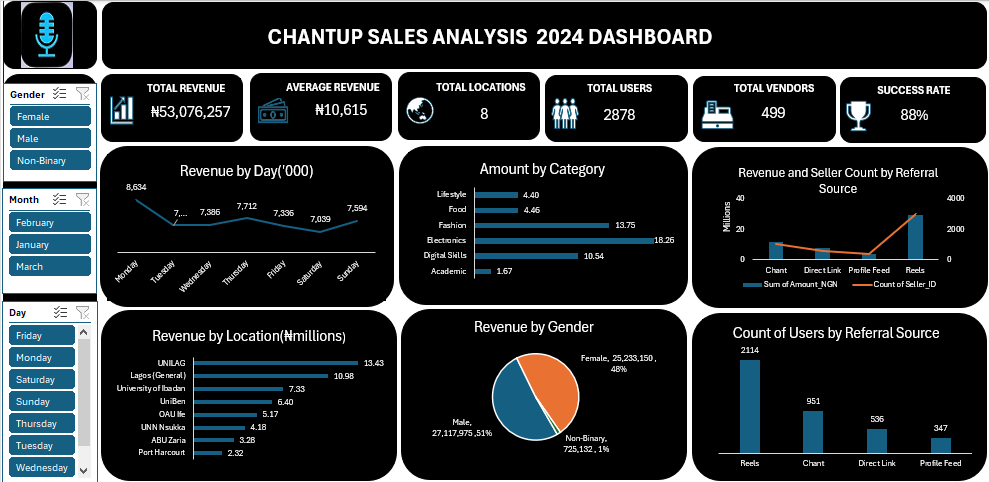
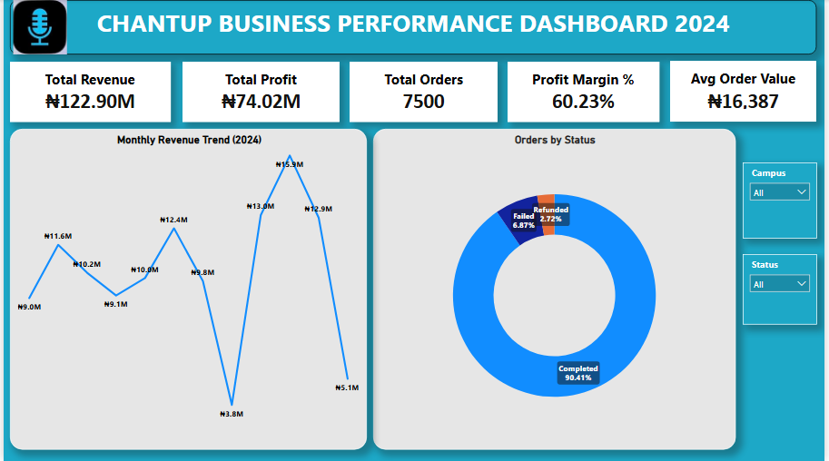
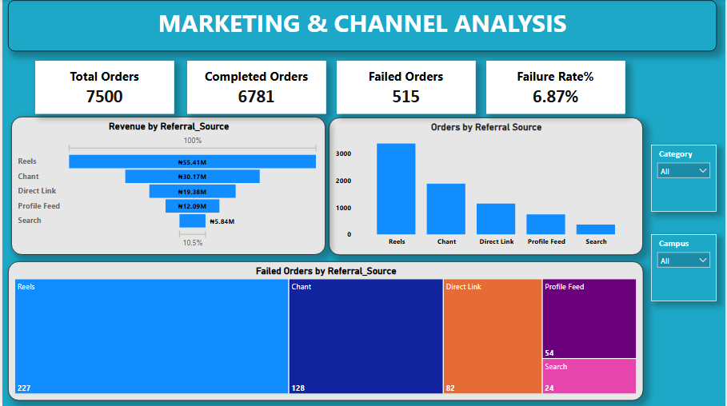
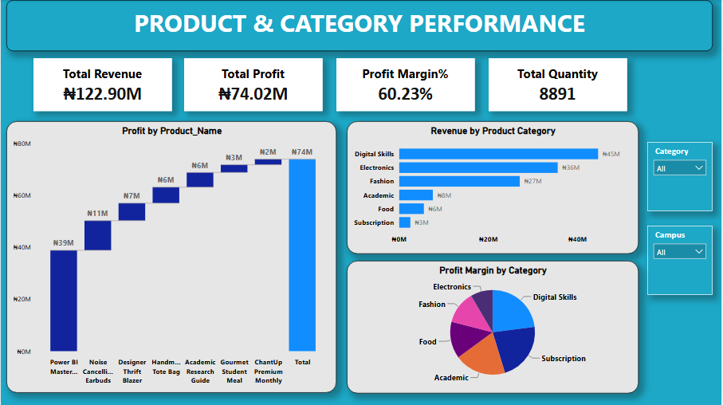
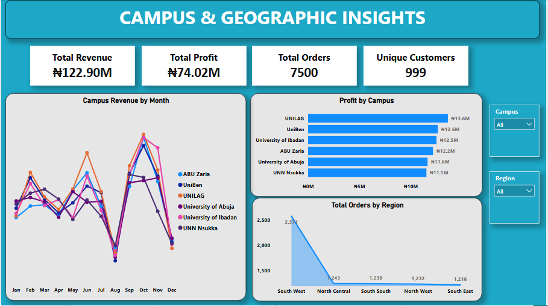

# ChantUp Business Analytics Dashboard

## Overview
A comprehensive business analytics dashboard 
built in both Microsoft Excel and Power BI 
to analyze ChantUp business performance 
and provide actionable insights.

## Dashboard Preview

### Excel Version

### Power BI Version
### Executive Overview Dashboard

### Marketing & Channel Analysis Dashboard

### Product & Category Performance Dashboard

### Campus & Geographic Insights Dashboard

## Objectives
- Analyze business performance metrics
- Build interactive KPI dashboard
- Create data visualizations
- Generate business insights

## Tools Used
- Microsoft Excel — Excel Dashboard Version
- Power BI Desktop — Interactive Dashboard Version
- Power Query (Data Cleaning)
- DAX (Data Analysis Expressions)

## Dashboard Features
- KPI Cards
- Interactive Charts
- Data Visualizations
- Business Insights

## Business Questions Answered
1. What is the overall business performance?
2. Which areas need improvement?
3. What are the key business metrics?

## Key Insights
- Comprehensive business performance analysis
- Interactive dashboard for decision making
- Data driven insights for business growth

## Business Recommendations
- Focus on high performing business areas
- Address underperforming segments
- Use data insights for strategic decisions

